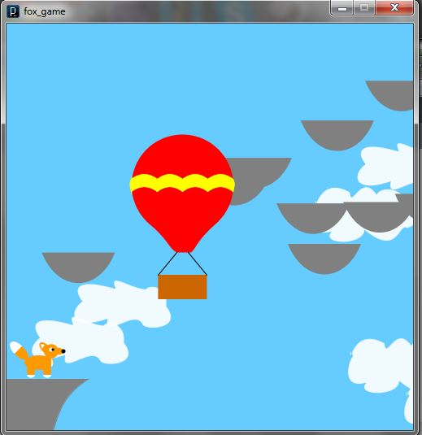

# Mr.-Fox-s-Great-Escape
A game created using Processing by Jenny Juarez. 

The object of the game is to land the fox inside the balloon by jumping from rock to rock. Each run the location and speed of the balloon changes. Players press space to jump, "." to go forward, "," to go back.

[Video Demo](https://www.youtube.com/watch?v=Ku4_0nocfHA&amp;)

